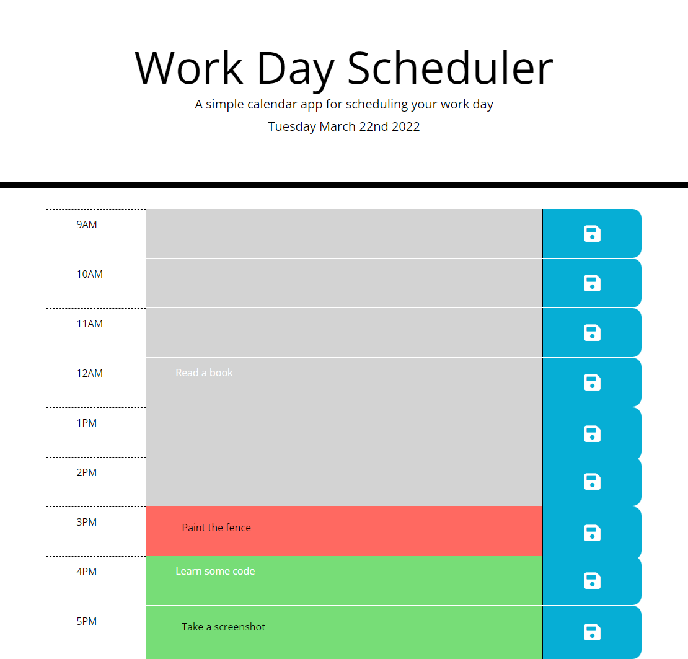

# Organizer
Week 4 - Daily Organizer Calendar

## About This Project

This site is a simple daily organizer. It allows the user to enter reminders or tasks for workday hours (9-5). The user can enter a task by clicking on the section that corresponds with the chosen time, entering text, and then clicking the save button. The tasks are saved to local storage, and will persist after the page has been refreshed.

The current date is displayed at the top of the page, and the hour blocks are colour-coded to indicate if tasks are in the past (grey), immidiately due (red), or in the future (green).

---
## Screenshots

Below screenshot of the site taken at 3:45pm. Grey time blocks have passed, red time block represents current time, green blocks indicate the future.

---
## Links
[Project Code on Github](https://github.com/philmcgarty/organizer "Github")

[Deployed Site](https://philmcgarty.github.io/organizer)